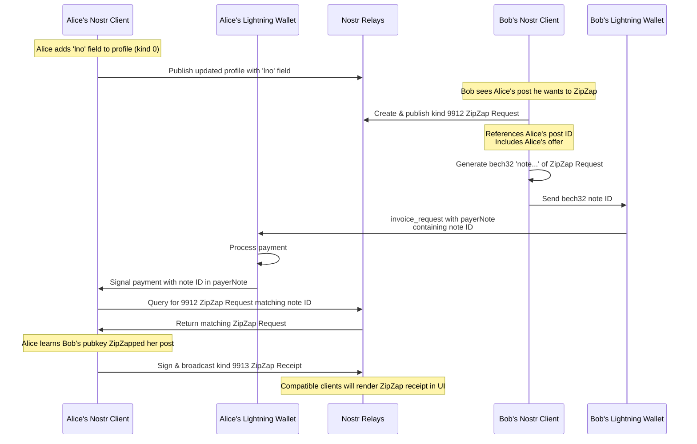

# ZipZap


Social media tipping using Lightning, BOLT 12, & Nostr

[⚡️ Try it out ⚡️](https://zipzapbolt12.netlify.app/)

*You will need a BOLT 12 enabled wallet/node in order to zap on this site, but you can still see the zaps without a wallet.*

## Development

First, run the development server:

```bash
yarn dev
```

Open [http://localhost:3000](http://localhost:3000) with your browser to see the result.

To use the wallet features, you will need to run [phoenixd](https://phoenix.acinq.co/server) on the same server (or local dev env) as the website. You will also need to set `NEXT_PUBLIC_USE_WALLET` to `true` and add the `PHOENIX_API_PASSWORD` in `.env`.

## ZipZap Protocol

[NIP-XX Draft - Work in Progress](https://github.com/sbddesign/nips/blob/bolt12zaps/XX.md)

### ZipZap Request

Draft of a ZipZap request note

```
{
  "kind": 9912,
  "content": "ZipZap!",
  "tags": [
    ["relays", "wss://mynostrrelay.xyz"],
    ["lno", "{lno_from_profile_of_post_author}"],
    ["p", "{pubkey_of_author_of_the_post}"],
    ["e", "{id_of_the_post}"]
  ],
  "pubkey": "{my_pubkey}",
  "created_at": {current_unix_timestamp},
  "id": "{event_id}",
  "sig": "{event_signature}"
}
```

### ZipZap Receipt

Draft of a ZipZap Receipt note

```
{
    "id": "{event_id}",
    "pubkey": "{my_pubkey_as_recipient}",
    "created_at": {invoice_paid_at},
    "kind": 9913,
    "tags": [
      ["p", "{my_pubkey_as_recipient}"],
      ["P", "{pubkey_of_zipzapsender (creator of the 9912 event)}"],
      ["e", "{id_of_my_post_that_was_zipzapped}"],
      ["lno", "{lno_from_profile_of_post_author}"],
      ["amount", {amount_of_payment}]
    ],
    "content": "",
    "sig": "{event_signature}"
  }
```

### Sequence Diagram


